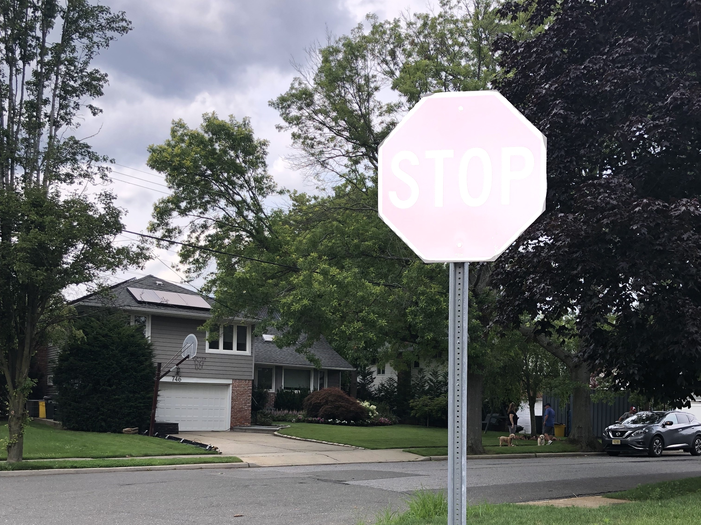

### Traffic Signal Detection

Using detectron2 to idenfity traffic signals with a semantic segmentation model. 

Current model is trained to identify stop signs but more traffic signs/signals will be added.

Train a new model before using the repo.

### Requirements

VS Build tools 2019

python 3.8 tested and working 

```console
pip install opencv-python

git clone https://github.com/facebookresearch/detectron2.git

cd detectron2

pip install -e .

```

### Example of detection


