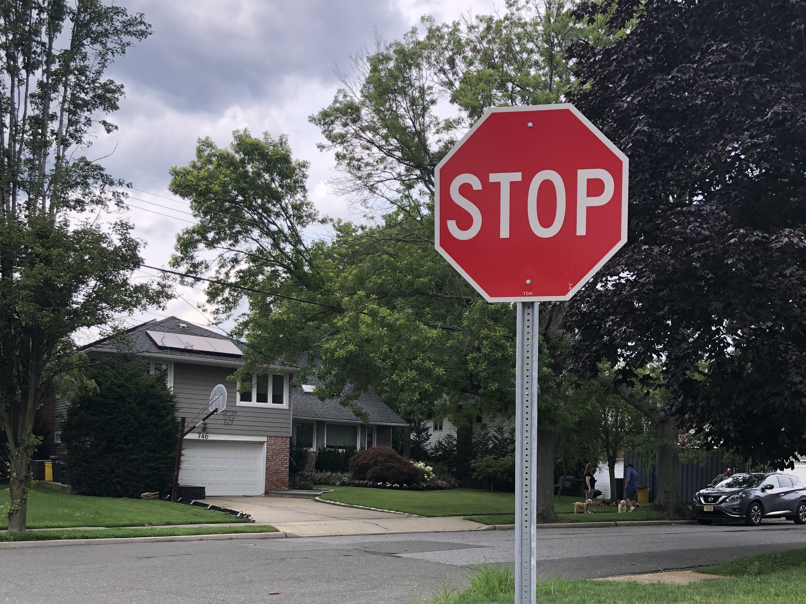

### Traffic Signal Detection

Using detectron2 to idenfity traffic signals with a semantic segmentation model. 

Current model is trained to identify stop signs but more traffic signs/signals will be added.

Train a new model before using the repo.

### Usage

First complete installations below, then proceed to comment in the # trainer.train() line to train the model. Feel free to change the ‘cfg.SOLVER.MAX_ITER = 1000’ value to whatever you choose. 

From there run the main.py file and open your local host URL in a browser. From there upload any image of a stop sign you find and see the detection displayed. 

### Requirements

VS Build tools 2019

python 3.9 tested and working 

```console
pip install Werkzeug
pip install Flask
pip3 install torch torchvision torchaudio --extra-index-url https://download.pytorch.org/whl/cu116
pip install opencv-python
pip install cython
git clone https://github.com/facebookresearch/detectron2.git
cd detectron2
pip install -e .
```

### Example of detection


